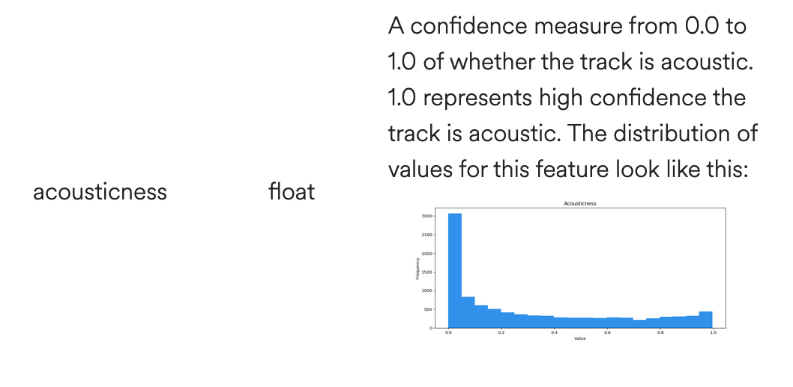

```{r setup, include=FALSE}
knitr::opts_chunk$set(echo = FALSE, warning = FALSE, message = FALSE, fig.align="center")
```

```{r}
library(metathis)

meta() %>%
  meta_description(
    "How Kanye West's music has evolved over time."
  ) %>% 
  meta_name("github-repo" = "connorrothschild/kanye") %>% 
  meta_viewport() %>% 
  meta_social(
    title = "The Birth, Death, and Rebirth of Kanye West",
    url = "https://r4ds.had.co.nz",
    image = "images/kanye.png",
    image_alt = "Kanye West",
    og_author = "Connor Rothschild",
    twitter_card_type = "summary",
    twitter_creator = "@CL_Rothschild"
  )
```


```{r}
library(spotifyr)
library(tidyverse)
library(RColorBrewer)
library(highcharter)

# input ids here
keys <- yaml::read_yaml("keys.yaml")
Sys.setenv(SPOTIFY_CLIENT_ID = keys$client_id)
Sys.setenv(SPOTIFY_CLIENT_SECRET = keys$client_secret)

access_token <- get_spotify_access_token()

kanye <- get_artist_audio_features('kanye west')

song_data <- kanye %>% 
  select(album_release_year, album_images, danceability:tempo, duration_ms, explicit,
         track_name, external_urls.spotify, album_name:key_mode)

### unlist albums and only return one

for (row in 1:nrow(song_data)) {
  song_data$album_images[[row]] <- song_data$album_images[[row]][['url']][[2]]
}

song_data$album_images <- unlist(song_data$album_images)

## a couple of duplicated album images, unsure why
song_data <- song_data %>% 
  mutate(album_images = ifelse(album_name == "My Beautiful Dark Twisted Fantasy",
                          "https://i.scdn.co/image/ab67616d00001e025bd363295a677dacd0b4187b",
                          album_images),
         album_images = ifelse(album_name == "Late Registration",
                          "https://i.scdn.co/image/ab67616d00001e02de720f487ec5a6a3cfad9ebb",
                          album_images),
         album_images = ifelse(album_name == "808s & Heartbreak",
                          "https://i.scdn.co/image/ab67616d00001e0265fbf56c2837be4879b5020a",
                          album_images)) 

song_data <- song_data %>% 
  mutate(album_name = ifelse(album_name == "Kanye West Presents Good Music Cruel Summer", "Good Music Cruel Summer", album_name),
         album_name = ifelse(album_name == "My Beautiful Dark Twisted Fantasy", "MBDTF", album_name),
         track_name = str_replace(track_name, "- Album Version *|\\(Interlude\\)|- Bonus Track|- Live At Abbey Road Studios", ""),
         track_name = gsub("(Edited)", "", track_name, fixed = TRUE),
         track_name = str_trim(track_name)) %>% 
  filter(track_name != str_detect(track_name, "Skit*"),
         album_name != "Graduation (Alternative Business Partners)") %>% 
  distinct(track_name, .keep_all = TRUE)

# write.csv(song_data, "../data/song_data.csv")

grouped <- song_data %>% 
  group_by(album_name) %>% 
  summarise_at(vars(danceability:tempo), mean) 

grouped <- grouped %>% 
  filter(album_name != "Graduation (Alternative Business Partners)" & album_name != "Late Orchestration") %>% 
  mutate(album_name = ifelse(album_name == "Kanye West Presents Good Music Cruel Summer", "Good Music Cruel Summer", album_name))

# write.csv(grouped, "../data/kanye_data.csv")

# lyrics <- get_album_data("Kanye West", "JESUS IS KING")
```

```{r, include = FALSE}
library(tidyverse)
library(ggbeeswarm)
library(plotly)

# song_data <- readr::read_csv("https://raw.githubusercontent.com/connorrothschild/R/master/born-again-kanye/song_data.csv")

# album doesn't really count, live album + combination of existing songs
song_data <- song_data %>% 
  filter(album_name != 'Late Orchestration')

options(scipen=999)
theme_set(theme_minimal())
```

```{r}
HTML('<div id="intro">
				<div class="tv">
					
				</div>
				<div class="title">
					<p class="small">The birth, death, and rebirth of</p>
					<p class="large black-red-text">KANYE</p>
					<p class="large black-red-text">WEST</p>
					
				</div>
				<div class="byline-div">
					<p class="byline">By <span class="bold">Connor Rothschild</span></p>
					<p class="byline">Submitted as a final project for <span class="bold">DSCI 304, Data Visualization</span></p>
				</div>
				<div class="lede-div">
		  <p class="prose" id="firstp">
			Kanye West is an international phenomemon. 
			The musical artist has sold over 140 million records worldwide and has 
			<a href = "https://guardian.ng/life/kanye-west-buys-14-million-wyoming-ranch/" 
			target = "_blank">received</a> 
			21 Grammy Awards.',
			"<br><br>Part of Kanye West's appeal is his musical variety. 
			His discography has been inspired by classic hip-hop as well as dubstep.
			<br><br>Fans of Kanye West will know that, 
			as often as his musical tenor has changed, so too has his persona. 
			<br><br>The 'Kanye' story is one of growth, struggle, triumph, and confusion.
			<br>This project hopes to demystify some of Kanye West's 
			evolution by exploring how, in specific, his <em>music</em> has changed over time.
			By analyzing audio features from Spotify, we're able to track
			the birth, death, and rebirth of Kanye West.
			</div></div>")
```

<!-- ## Spotify Audio Features -->

To answer the question of *how* Kanye West's music has changed, we rely on audio features provided by Spotify. Although we won't look at every feature (there are dozens), here's a glimpse:

<div class = 'center'>
  
</div>

For each audio feature (such as acousticness), every song on Spotify is given a score, usually between 0 and 1. For a full list of audio features, visit the [Spotify API](https://developer.spotify.com/documentation/web-api/reference/tracks/get-audio-features/).

### Danceability

As an example, let's look at the danceability of each song in Kanye West's collection.

```{r, echo=FALSE, warning=FALSE}
plot_danceability <- song_data %>%
  mutate(album_name = reorder(album_name, danceability)) %>%
  ggplot(aes(x = danceability, y = album_name)) + 
  geom_quasirandom(mapping = aes(colour = danceability,
                              text = glue::glue(
                                '<span style = "font-size:1.2em">{track_name}</span><br>
                                                    Danceability: {danceability}'
                              )), 
                groupOnX = FALSE, size = 3, alpha = .6) +
  scale_color_viridis_c(direction = -1) +
  stat_summary(fun = mean, fun.min = mean, fun.max = mean,
               geom = "crossbar", width = .75, inherit.aes = TRUE) +
  theme(
    legend.position = 'none'
  ) +
  labs(x = 'Danceability',
       y = '')

div(class = 'center',
ggplotly(plot_danceability, tooltip = 'text') %>%
  layout(
    title = list(element_blank()),
    # legend = list(x = 0.65, y = 0.925),
    font = list(family = 'Lato'),
    # margin = list(t = 50),
    hoverlabel = list(bgcolor = 'whitesmoke', color = 'darkGray')
  ) %>%
  config(
    displaylogo = F,
    showSendToCloud = F,
    displayModeBar = F
  )
)
```

According to the data, one of the least danceable songs of Kanye's discography is *I'll Fly Away*, from his 2004 album *The College Dropout*. Just how un-danceable is it? Go ahead and listen for yourself, here:

<div class = 'center'><iframe src="https://open.spotify.com/embed/track/6MgGapP3EPFm9kYUvYBTZR" width="300" height="380" frameborder="0" allowtransparency="true" allow="encrypted-media"></iframe></div>

Sure enough. Good luck dancing to that!

### Valence

You may have noticed that most Kanye albums have similar danceability scores; a fact which makes that audio feature less capable of answering our questions about Kanye West's musical rebirth.

A more illuminating feature is that of *valence*, defined by Spotify as "a measure used by Spotify to determine the 'musical positiveness conveyed by a track.' Tracks with high valence sound more positive (e.g. happy, cheerful, euphoric), while tracks with low valence sound more negative (e.g. sad, depressed, angry)."

```{r, echo = FALSE}
plot_valence <- song_data %>%
  mutate(album_name = reorder(album_name, valence)) %>%
  ggplot(aes(x = valence, y = album_name)) + 
  geom_quasirandom(mapping = aes(colour = valence,
                              text = glue::glue(
                                '<span style = "font-size:1.2em">{track_name}</span><br>
                                                    Valence: {valence}'
                              )), 
                groupOnX = FALSE, size = 3, alpha = .6) +
  scale_color_viridis_c(direction = -1) +
  stat_summary(fun = mean, fun.min = mean, fun.max = mean,
               geom = "crossbar", width = .75, inherit.aes = TRUE) +
  theme(
    legend.position = 'none'
  ) +
  labs(x = 'Valence',
       y = '')

div(
  class = 'center',
  ggplotly(plot_valence, tooltip = 'text') %>%
    layout(
      title = list(element_blank()),
      # legend = list(x = 0.65, y = 0.925),
      font = list(family = 'Lato'),
      # margin = list(t = 50),
      hoverlabel = list(bgcolor = 'whitesmoke', color = 'darkGray')
    ) %>%
    config(
      displaylogo = F,
      showSendToCloud = F,
      displayModeBar = F
    )
)
```

Here, we notice a much greater spread in song's, and album's, valence scores. Let's focus on albums for simplicity's sake.

If we instead look at valence averaged across each album, we can see how the albums on the aggregate differ.

```{r}
plot_df <- song_data %>%
  group_by(album_name, album_images, album_release_year) %>% 
  summarise(valence = mean(valence)) %>% 
  arrange(desc(valence)) %>% 
  ungroup() %>% 
  # rowwise %>%
  mutate(
    tooltip = paste0(
      '<a style = "margin-right:',
      max(nchar(album_name)) + 100,
      'px">',
      '',
      '<b>Album:</b> ',
      album_name,
      '<br><b>Average Valence</b>: ',
      round(valence, 2),
      '<br><b>Year released</b>: ',
      album_release_year,
      '</a>'
    )
  ) %>%
  mutate(album_name = reorder(album_name, -valence))

hchart(plot_df, type = "bar", hcaes(x = album_name, y = valence)) %>%
  hc_tooltip(formatter = JS(paste0(
    "function() {return this.point.tooltip;}"
  )),
  useHTML = T) %>%
  hc_title(text = paste0("Kanye's Valence")) %>%
  hc_subtitle(text = paste0(
    "Kanye West's valence by album"
  )) %>%
  hc_add_theme(hc_theme_smpl()) %>%
  hc_xAxis(title = list(text = '')) %>%
  hc_yAxis(title = list(text = "Valence"))
```

And finally, the most complete way to visualize these trends over time, with the addition of song-level data:

```{r}
plot_df <- song_data %>%
    # rowwise %>%
    mutate(tooltip = paste0('<a style = "margin-right:', max(max(nchar(track_name), nchar(album_name)) * 7, 55), 'px">', # dynamic sizing
                            '',
                            '<b>Album:</b> ', album_name,
                            '<br><b>Track:</b> ', track_name)) %>%
    ungroup

avg_line <- plot_df %>%
    group_by(album_release_year, album_name, album_images) %>%
    summarise(avg = mean(valence)) %>%
    ungroup %>%
    transmute(x = as.numeric(as.factor(album_release_year)),
              y = avg,
              tooltip = paste0('<a style = "margin-right:', 
                               max(nchar(album_name)) * 7, 'px">',
                               '',
                               '<b>Album:</b> ', album_name,
                               '<br><b>Average Valence</b> ', round(avg, 2),
                               '</a>')
    )

plot_track_df <- plot_df %>%
    mutate(tooltip = paste0(tooltip, '<br><b>Valence:</b> ', valence, '</a>'),
           album_number = as.numeric(as.factor(album_release_year))) %>%
    ungroup

album_chart <- hchart(plot_track_df, 'scatter', hcaes(x = as.numeric(as.factor(album_release_year)), y = valence, group = album_name)) %>%
    hc_add_series(data = avg_line, type = 'line') %>%
    hc_tooltip(formatter = JS(paste0("function() {return this.point.tooltip;}")), 
               useHTML = T) %>%
    hc_colors(c(sample(brewer.pal(n_distinct(song_data$album_name), 'Paired')), 'black')) %>%
    hc_xAxis(title = list(text = 'Album'), labels = list(enabled = F)) %>%
    hc_yAxis(max = 1, title = list(text = 'Valence')) %>%
    hc_title(text = "Kanye's Mood") %>%
    hc_subtitle(text = "Kanye West's song sadness (valence) by album") %>%
    hc_add_theme(hc_theme_smpl())
album_chart$x$hc_opts$series[[13]]$name <- 'Album Averages'
album_chart
```

Following his 2007 album *Graduation*, Kanye West's music became considerably darker. That's because the years that followed *Graduation* were years filled with loss, depression, and global infamy. Kanye's mother passed away in December 2007, just two months after the release of Graduation. This sparked a deep depression, and in the years that followed, the situation only got worse. In 2009, Mr. West became a global phenomenon after he interrupted Taylor Swift's Video Music Awards recognition and instead claimed that Beyonce had 'one of the best videos of all time.'

<div class = "center"><iframe width="560" height="315" src="https://www.youtube.com/embed/UIfyvZDrcwA" frameborder="0" allow="accelerometer; autoplay; encrypted-media; gyroscope; picture-in-picture" allowfullscreen></iframe></div>

It was in the aftermath of events such as these that Kanye spiralled into a deep depression. In his own words:

<div class = 'center'><blockquote class='rg_standalone_container' data-src='//genius.com/annotations/1048197/standalone_embed'><a href='https://genius.com/1048197/Kanye-west-jay-z-and-big-sean-clique/Went-through-deep-depression-when-my-mama-passed-suicide-what-kinda-talk-is-that'>Went through, deep depression when my mama passed <br> Suicide, what kinda talk is that?</a><br><a href='https://genius.com/Kanye-west-jay-z-and-big-sean-clique-lyrics'>&#8213; Kanye West – Clique</a></blockquote></div>

That explains why Kanye West's discography up until Graduation has an average valence score of `r song_data %>% filter(album_release_year < 2008) %>% summarise(round(mean(valence),2))`, and those albums released *after* Graduation have an average valence score of `r song_data %>% filter(album_release_year > 2007) %>% summarise(round(mean(valence),2))`.

---

## The Jesus is King Effect

Most recently, Kanye West went through a self-described spiritual and political transformation. Starting in 2019, it became apparent that Kanye was definitely not his old self, from becoming a born-again Christian to dabbling in the political arena. 

<div class = 'center'>
  
</div>

It was during this time that Kanye came out with his arguably most unique album yet: *Jesus Is King*. 

Jesus Is King (stylized JESUS IS KING) was released on October 25, 2019 in collaboration with West's newly formed gospel group the [Sunday Service Choir](https://en.wikipedia.org/wiki/Sunday_Service_Choir). When asked about the album and its purpose, Kanye [replied](https://www.nytimes.com/2019/09/30/arts/music/kanye-west-jesus-is-king.html):

> This album has been made to be an expression of the gospel and to share the gospel and the truth of what Jesus has done to me. When I think of the goodness of Jesus and all that he does for me, my soul cries out.

The question hasn't yet been answered: is Kanye in a new era of music? Does the release of *Jesus is King* represent a new era in Kanye's discography, akin to the post-Graduation Kanye but in the opposite direction?

I'll leave the definitive answer to this question unresolved, particularly because we are yet to see how Kanye's music will continue to differ after *Jesus Is King*.

But here, you can explore each of Spotify's seven audio features to answer the question: how does Kanye West's most recent album compare to his previous ones? Aside from his spiritual transformation, has he been musically born again? 

```{r, fig.align='center'}
library(shiny)

features_options <-
  c("Danceability", "Tempo", "Energy", "Loudness", "Mode", "Speechiness",
    "Acousticness", "Liveness", "Valence", "Duration (ms)")

selectInput("feature_selected", label = "Audio Feature",
            choices = features_options,
            selected = features_options[1]
            )
```

```{r}
renderHighchart({
  
  get_feature_column <- function(song_data, name) {
    if (name == "Danceability") {
      data_filtered <- song_data %>% 
        group_by(album_name) %>% 
        summarise(feature = mean(danceability)) %>% 
        arrange(desc(feature)) %>% 
        ungroup()
    } else if (name == "Tempo") {
      data_filtered <- song_data %>% 
        group_by(album_name) %>% 
        summarise(feature = mean(tempo)) %>% 
        arrange(desc(feature)) %>% 
        ungroup()
    } else if (name == "Energy") {
      data_filtered <- song_data %>% 
        group_by(album_name) %>% 
        summarise(feature = mean(energy)) %>% 
        arrange(desc(feature)) %>% 
        ungroup()
    } else if (name == "Loudness") {
      data_filtered <- song_data %>% 
        group_by(album_name) %>% 
        summarise(feature = mean(loudness)) %>% 
        arrange(desc(feature)) %>% 
        ungroup()
    } else if (name == "Mode") {
      data_filtered <- song_data %>% 
        group_by(album_name) %>% 
        summarise(feature = mean(mode)) %>% 
        arrange(desc(feature)) %>% 
        ungroup()
    } else if (name == "Speechiness") {
      data_filtered <- song_data %>% 
        group_by(album_name) %>% 
        summarise(feature = mean(speechiness)) %>% 
        arrange(desc(feature)) %>% 
        ungroup()
    } else if (name == "Acousticness") {
      data_filtered <- song_data %>% 
        group_by(album_name) %>% 
        summarise(feature = mean(acousticness)) %>% 
        arrange(desc(feature)) %>% 
        ungroup()
    } else if (name == "Liveness") {
      data_filtered <- song_data %>% 
        group_by(album_name) %>% 
        summarise(feature = mean(liveness)) %>% 
        arrange(desc(feature)) %>% 
        ungroup()
    } else if (name == "Valence") {
      data_filtered <- song_data %>% 
        group_by(album_name) %>% 
        summarise(feature = mean(valence)) %>% 
        arrange(desc(feature)) %>% 
        ungroup()
    } else if (name == "Duration (ms)") {
      data_filtered <- song_data %>% 
        group_by(album_name) %>% 
        summarise(feature = mean(duration_ms)) %>% 
        arrange(desc(feature)) %>% 
        ungroup()
    }
    
    
  }
  
  data_filtered <- get_feature_column(song_data, input$feature_selected)
  #data_filtered <- get_feature_column(song_data, "Danceability")
  
  images_and_years <- song_data %>% 
    select(album_name, album_images, album_release_year) %>% 
    distinct()
  
  data_filtered <- left_join(data_filtered, images_and_years, by = "album_name")

  cols <- c('black', 'white')
  
  plot_df <- data_filtered %>%
    # rowwise %>%
    mutate(tooltip = paste0('<a style = "margin-right:', 
                            max(nchar(album_name)) + 70, 'px">', # dynamic sizing
                            '',
                            '<b>Album:</b> ', album_name,
                            '<br><b>Average ', input$feature_selected, '</b>: ',
                            round(feature, 2),
                               '</a>')) %>%
    mutate(album_name = reorder(album_name, -feature),
           is_JIK = ifelse(album_name == "JESUS IS KING", "1", "0"))
  
  hchart(plot_df, type = "bar", hcaes(x = album_name, y = feature, color = is_JIK)) %>% 
    hc_colors(cols) %>% 
    hc_tooltip(formatter = JS(paste0("function() {return this.point.tooltip;}")),
               useHTML = T) %>%
    hc_title(text = paste0("Kanye's ", input$feature_selected)) %>%
    hc_subtitle(text = paste0("Kanye West's ", 
                              stringr::str_to_lower(input$feature_selected), 
                              " by album")) %>%
    hc_add_theme(hc_theme_smpl()) %>% 
    hc_xAxis(title = list(text = '')) %>%
    hc_yAxis(title = list(text = input$feature_selected))
})
```